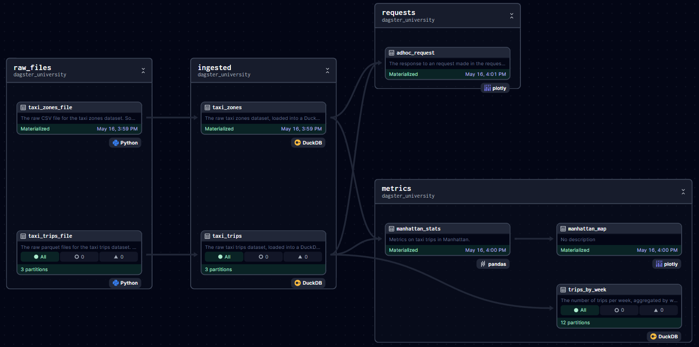

# dagster_university

This is a [Dagster](https://dagster.io/) project made to accompany Dagster University coursework.



## Getting started

First, install your Dagster code location as a Python package by running the command below in your terminal. By using the --editable (`-e`) flag, pip will install your Python package in ["editable mode"](https://pip.pypa.io/en/latest/topics/local-project-installs/#editable-installs) so that as you develop, local code changes will automatically apply.

```bash
pip install -e ".[dev]"
```

Duplicate the `.env.example` file and rename it to `.env`.

Then, start the Dagster UI web server:

```bash
dagster dev
```

Open http://localhost:3000 with your browser to see the project.

## Development

### Adding new Python dependencies

You can specify new Python dependencies in `setup.py`.

## Deploy on Dagster Cloud

The easiest way to deploy your Dagster project is to use Dagster Cloud.

Check out the [Dagster Cloud Documentation](https://docs.dagster.cloud) to learn more.
